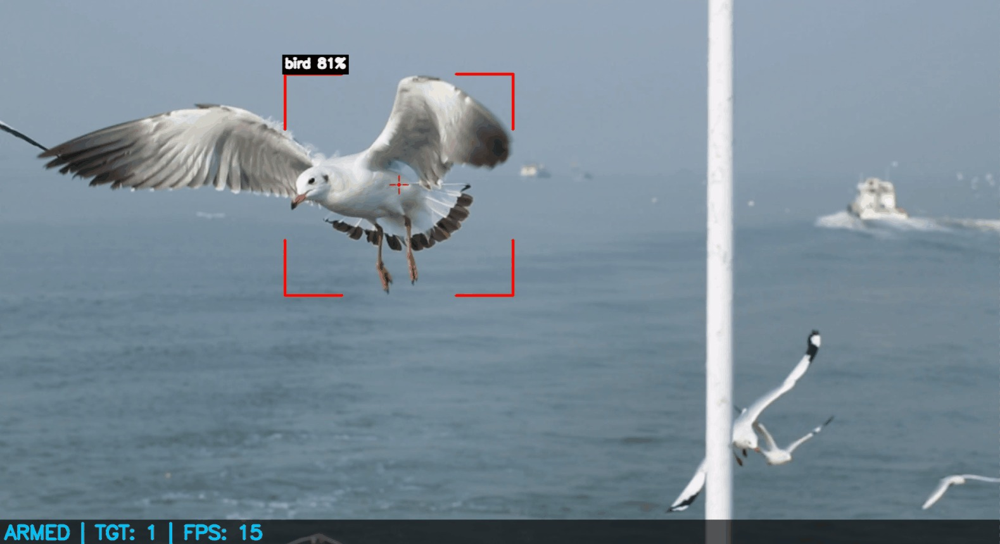
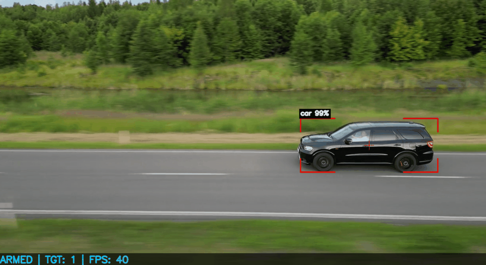

# VigilantEye 👁️‍🗨️  
**Real-Time UAV / Object Tracking Pipeline (C++17 + OpenCV)**  


> **VigilantEye** is a modular, real-time vision pipeline designed to capture frames from multiple sources, run detection/tracking, and render an overlay/HUD — with a clean HAL-style architecture to support future sensors and actuators.

---

## 🖼️ Screenshots
> Images are stored under `assets/screenshots/`

 

---

## ✨ Highlights
- **Pluggable Frame Sources (HAL/Sensors)**: webcam & video file today, RTSP/network source planned.
- **Vision Modules (Vision)**:
  - DNN-based detection (OpenCV DNN + YOLOv4-tiny model files in `config/models/`)
  - Motion detection
  - Object tracking interface ready for expansion
- **Pipeline-driven architecture** (Core): frame → detect/track → HUD/overlay.
- **Portable runtime config**: `config/` is copied next to the executable after build for easy runs.

---

## 🧱 Architecture (High-Level)

```mermaid
flowchart LR
  A[Frame Source<br/>Webcam / Video File / (RTSP planned)] --> B[Core::Pipeline]
  B --> C[Vision Algorithms<br/>DNN Detector / Motion Detector / Tracker]
  C --> D[UI::HUD Overlay]
  D --> E[Output Frame / Display]
```

---

## 📁 Project Structure

```text
VigilantEye/
├─ assets/
│  └─ screenshots/
│     ├─ Shot1.jpeg
│     └─ Shot2.png
├─ config/
│  ├─ models/
│  │  ├─ coco.names.txt
│  │  ├─ yolov4-tiny.cfg
│  │  └─ yolov4-tiny.weights
│  └─ system_config.json
├─ include/
│  ├─ Core/
│  ├─ GeneralUtils/        (Logger, SafeQueue)
│  ├─ HAL/
│  │  ├─ Actuators/        (IMotorController, VirtualMotor)
│  │  └─ Sensors/          (IFrameSource, WebcamSource, VideoFileSource)
│  ├─ UI/                  (HUD)
│  └─ Vision/              (DNNObjectDetector, MotionDetector, ObjectTracker, IVisionAlgorithm)
├─ src/
│  ├─ Core/                (Pipeline.cpp, SystemController.cpp)
│  ├─ GeneralUtils/         (Logger.cpp)
│  ├─ HAL/Sensors/          (WebcamSource.cpp, VideoFileSource.cpp)
│  └─ Vision/               (DNNObjectDetector.cpp, MotionDetector.cpp, ObjectTracker.cpp)
├─ tests/
├─ vcpkg/                   (submodule)
├─ CMakeLists.txt
├─ CMakePresets.json
├─ vcpkg.json
├─ demo.mp4
└─ main.cpp
```

---

## ✅ Requirements
- **C++17 compiler**
- **CMake**
- **OpenCV** (installed via vcpkg manifest or system install)
- Windows recommended setup: **Visual Studio 2022** generator preset.

---

## ⚡ Build & Run (Windows / Visual Studio + vcpkg preset)

### 1) Clone with submodules
```bash
git clone --recurse-submodules <YOUR_REPO_URL>
cd VigilantEye
```

### 2) Configure & build (CMake Presets)
```bash
cmake --preset vs-debug
cmake --build --preset build-vs-debug
```

### 3) Run
After building, run the executable from the build output folder.

---

## 🧩 Configuration
Runtime configuration lives in:
- `config/system_config.json`

Use it to select the input source (webcam / video) and configure vision modules (detector/tracker parameters).  
*(If you want, paste the JSON here and I’ll document every field cleanly in the README.)*

---

## 🧠 Models (YOLOv4-tiny)
The repo includes model assets under:
- `config/models/yolov4-tiny.cfg`
- `config/models/yolov4-tiny.weights`
- `config/models/coco.names.txt`

The **DNNObjectDetector** loads these files using OpenCV DNN to perform object detection.

---

## 🛣️ Roadmap (Planned)
- [ ] **RTSPSource**: network/IP camera stream support
- [ ] UI: richer HUD (labels, confidence, tracking IDs, FPS)
- [ ] Actuators: real motor controller integration (beyond VirtualMotor)
- [ ] Tests: unit tests for utils + vision components
- [ ] Docs: diagrams + usage examples

---

## 🧪 Notes
- This repository is **actively developed** — interfaces and modules are designed for growth as new sensors/algorithms are added.
- Contributions / suggestions are welcome (issues / PRs).

---

## 📜 License
Licensed under the **MIT License** (see `LICENSE`).
